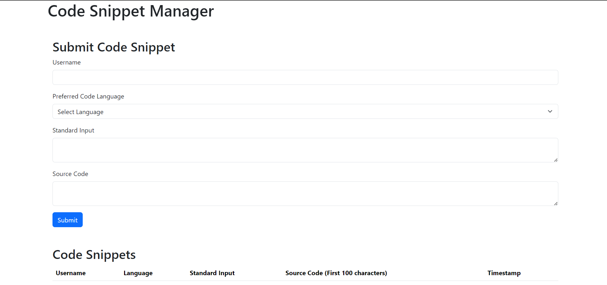
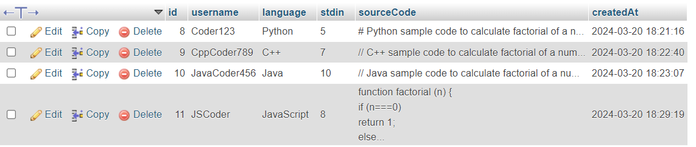

# Code Snippets Web Application

This web application allows users to submit code snippets along with relevant information and view them in a tabular format. Users can provide their username, preferred code language, standard input, and the source code. The application is built using Express.js for the backend and React.js for the frontend.

## Features

- Users can submit code snippets with their username, preferred language, standard input, and source code.
- Submitted code snippets are displayed in a tabular format on the frontend, showcasing the username, language, input, and timestamp.
- The frontend is hosted on Netlify, providing a publicly accessible URL: [Code Snippets Web Application](https://ornate-churros-7ed3f1.netlify.app/)
- The backend is not currently deployed due to certain limitations.

## Demo

Watch a tutorial video demonstrating how to fill the form and store data: [Tutorial Video](data/videodata.mp4)

## Screenshots

## Backend

The backend of this application is built using Express.js. To run the backend locally:

1. Navigate to the `backend` directory.
2. Install the dependencies using `npm install`.
3. Start the server using `npm start`.

## Frontend

The frontend of this application is built using React.js. To run the frontend locally:

1. Navigate to the `frontend` directory.
2. Install the dependencies using `npm install`.
3. Start the development server using `npm start`.

## Deployment

- The frontend is deployed on Netlify.
- To deploy the backend, follow the deployment instructions provided by your hosting provider, such as Heroku or AWS.

## Technologies Used

- Frontend: React.js, Axios, HTML, CSS
- Backend: Express.js, Node.js
- Database: MySQL

## Contributions

Contributions are welcome! If you encounter any issues or have suggestions for improvements, please feel free to submit a pull request.

